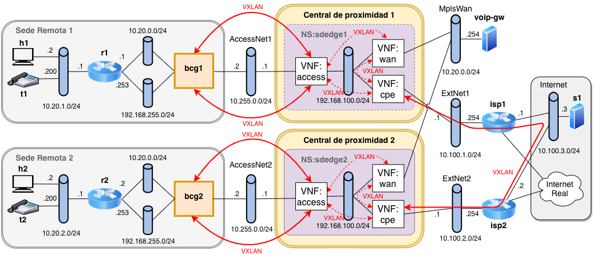
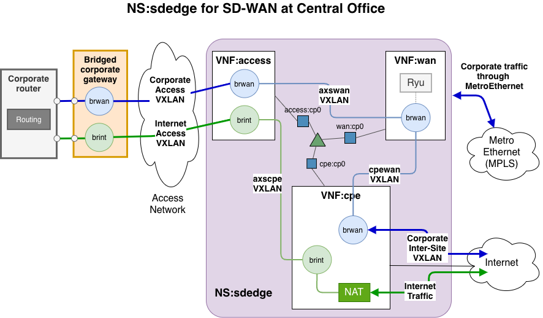

# sdwan-as-a-service
SD-Wan as a Service Demo

## Diagrams 



## Requirements
Test using the following ova containing a running version of OSM with vim-emu.

- [VNXSDNNFVLAB2020-v2.ova](https://idefix.dit.upm.es/download/vnx/vnx-vm/VNXSDNNFVLAB2020-v2.ova)

## Quick guide 
1. Run ./init.sh to create networks that are external to OSM

2. Start the VNX scenario vnx/sdedge\_nfv.xml

```shell
sudo vnx -f vnx/sdedge_nfv.xml -t
```

3. Create docker images in img

```shell
cd img/vnf-access
sudo docker build -t vnf-access .
cd ../vnf-cpe 
sudo docker build -t vnf-cpe .
cd ../vnf-wan 
sudo docker build -t vnf-wan .
cd ..
```

4. Onboarding on OSM of vnfs and network service from pck folder

5. Registration of two vim-emu instances

```shell
bin/osm-restart-vimemu2 
```

6. Instantiation of sdedge1 on central1-x and sdedge2 on central2-x with OSM

7. Run 

```shell
./sdedge1
./sdedge2
./policies
```

8. Start vnf consoles 

```shell
bin/sdw-manage-vnf-consoles open
```

9. Test connectivity

  - From host capture isp1-isp2 traffic:  

```shell
tshark -i isp1-e2
```

  - Between remote sites:
     * From h1 to h2 ping 10.20.2.2
       Traffic goes through isp1 and isp2

     * From t1 to t2 ping 10.20.2.200
       Traffic is not captured, it is forwarded through MPLS

  - From a site to a central voip-gw: from h1, ping 10.20.0.254
    Traffic is forwarded throuh MPLS

10. Terminate instances using:

```shell
./ns_terminate.sh sdedge1
./ns_terminate.sh sdedge2 
```

